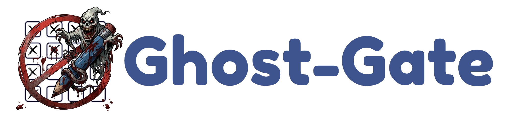

#  GHOST-GATE (GG)

**Ghost-Gate (GG)**, üniversite yoklama sistemlerini modernize eden, güvenli mesh network tabanlı bir otomasyon ve erişim protokolüdür. Geleneksel yöntemlerin kısıtlamalarını aşarak, öğrenciler için benzersiz bir "Secure Peer" deneyimi sunar.

  

---

## 🚀 Temel Özellikler

### 📱 Ghost-Gate Mobile (Android)
- **Multi-Account Sync:** Tek bir cihaz üzerinden sınırsız sayıda öğrenci hesabını yönetin.
- **One-Tap Attendance:** Tüm hesaplar için tek dokunuşla eşzamanlı yoklama girişi.
- **Akıllı Bildirimler:** Derslerinizin yoklaması başladığında anlık bildirimler.

### 🌐 Secure Web Portals (iOS & PC)
Ghost-Gate ağı, fiziksel konum zorunluluğunu ortadan kaldırır. Sınıfta ağa bağlı **tek bir kişi** olması, herkesin o derse uzaktan güvenli bir şekilde erişimini sağlar.
- [https://ghostgate.trydnx.workers.dev/](https://ghostgate.trydnx.workers.dev/)
- [https://ghostgate.vercel.app/](https://ghostgate.vercel.app/)

### 🛡️ Mesh Network (P2P) Protokolü
- Sistem tamamen yardımlaşma üzerine kuruludur.
- **Golden Key Sharing:** Sınıf içindeki bir cihaz yoklama yakaladığında, bu veri şifreli bir kanal üzerinden ağdaki tüm düğümlere dağıtılır.
- **Secure Bridge:** Web istemcileri, bu mesh ağına birer "Remote Peer" olarak bağlanır.

---

## 📖 Kullanım Kılavuzu

1.  **Kurulum:** En güncel [GhostGate APK](https://github.com/trydnx/GhostGateP2P/releases/download/v1.0.0/GhostGate_v1_0_0.apk) dosyasını indirin ve kurun.
2.  **Yetkilendirme:** Uygulama içinden veya web portalından öğrenci numaranız ve şifrenizle giriş yapın.
3.  **Sync:** Yoklama açıldığında ağ düğümleri otomatik senkronize olur. Size sadece **"Yoklamaya Dahil Ol"** butonuna basmak kalır.

---

## ⚠️ Yasal Uyarı
Bu proje eğitim, güvenlik araştırmaları ve sistem analizi amacıyla geliştirilmiştir. Sistemin akademik dürüstlük kuralları çerçevesinde kullanılması önerilir. Oluşabilecek tüm sorumluluk son kullanıcıya aittir.

---

  Developed by <b>TRYDNX</b> 
  <i>"Digital Freedom through Secure Peer Networks"</i>

